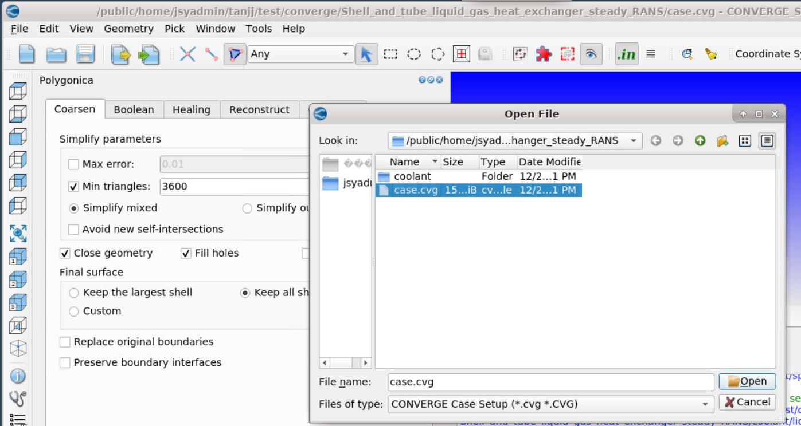
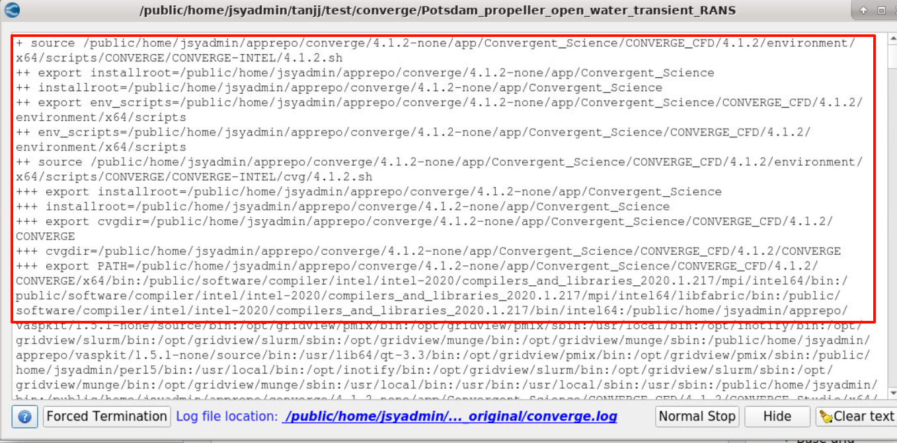

[TOC]

---
# 图形
## 启动脚本示例

```bash
#!/bin/bash
#SBATCH -p kshcnormal
#SBATCH -N 2 
#SBATCH --ntasks-per-node=30
#SBATCH --exclusive

# module加载
module purge
module load  compiler/intel/2021.3.0   mpi/intelmpi/2021.3.0

# 图形启动参数
export DISPLAY=vncserver01:17
export QT_OPENGL=software
export MESA_GL_VERSION_OVERRIDE=3.3

# 软件启动环境
export RLM_LICENSE=50531@10.15.200.4
SCRIPTDIR=/public/home/jsyadmin/apprepo/converge/4.1.2-none
export PATH=$PATH:$SCRIPTDIR/app/Convergent_Science/CONVERGE_CFD/4.1.2/CONVERGE_Studio/x64/bin
export PROGLIST=$SCRIPTDIR/app/Convergent_Science/CONVERGE_CFD/4.1.2/CONVERGE_Studio/x64/bin/CONVERGE_Studio
export LD_LIBRARY_PATH=$SCRIPTDIR/app/Convergent_Science/CONVERGE_CFD/4.1.2/CONVERGE/x64/lib64:$SCRIPTDIR/app/Convergent_Science/CONVERGE_CFD/4.1.2/CONVERGE/x64/lib64/INTEL:$LD_LIBRARY_PATH

# 图形启动
$PROGLIST -o
```

!!! tip
    1. 图形脚本里`module load compiler/intel/2020.1.217 mpi/intelmpi/2020.1.217` 走图形计算并不会识别相关环境参数要在`/Path-to/Convergent_Science/CONVERGE_CFD/4.1.2/environment/x64/scripts/CONVERGE/CONVERGE-INTEL/4.1.2.sh`[配置](#font)
    2. 图形闪退的话启动参数加上`-o` 

## 图形计算设置
### 算例设置
#### 导入算例文件
点击`File --> Open project --> 选择*.cvg`


!!! tip
    `*cvg`是保存的图形配置文件<br>`*.in *.dat`是输入文件<br>`*.echo、*.out、outputs_original`等是输出文件 

#### 导入setup
点击`File-->Import case setup-->算例所在目录`


!!! tip
    选中的目录文件所在位置，不是任何文件，软件会自动识别目录下的配置文件

### 并行设置
#### 界面参数设置
以`CONVERGE 4.1.2`版本为例，其余版本可能会有些差异，但大同小异，点击`Edit --> Preferences --> CONVERGE`


- `CONVERGE root`设置为`/PATH-TO/Convergent_Science/CONVERGE_CFD`
- `MPI`版本类型设置为`INTEL MPI`即可
- `number of processes`设置为申请资源的核数，`hostfile`不用设置，`mpirun`会自动识别
- `License`根据实际版本设置浮动许可或者本地授权文件

!!! tip
    1. `MPI type`选中后未出现，点击ok后再打开一下
    2. `MPI type`无法切换，可以删下配置文件`rm -fr  ~/.config/Convergent\ Science\ Inc./CONVERGE_Studio.conf`，后重新打开软件

#### 并行配置文件<div id="font"></div>
以选中`INTEL MPI`为例，图形计算的环境激活文件为`/PATH-TO/Convergent_Science/CONVERGE_CFD/4.1.2/environment/x64/scripts/CONVERGE/CONVERGE-INTEL/4.1.2.sh`

```bash
export installroot=/public/home/jsyadmin/apprepo/converge/4.1.2-none/app/Convergent_Science
export env_scripts=$installroot/CONVERGE_CFD/4.1.2/environment/x64/scripts
source $env_scripts/CONVERGE/CONVERGE-INTEL/cvg/4.1.2.sh
source $env_scripts/CONVERGE/CONVERGE-INTEL/mpi/4.1.2.sh
source $env_scripts/CONVERGE/CONVERGE-INTEL/utilities/4.1.2.sh
source $env_scripts/CONVERGE/CONVERGE-INTEL/udf/4.1.2.sh

# When ParaView is installed
if [[ -d $installroot/ParaView/5.11.0 ]]; then
  source $env_scripts/paraview/INTEL/5.11.0.sh
```
可见会涉及到目录下`mpi、cvg、tilities、udf、paraview`等配置文件

- `mpi/4.1.2.sh`中将集群的加载的调试环境填入，原先的环境均可以注释，`mpi`的实际影响环境文件可以在此脚本中调试配置
```bash
module purge
module load  compiler/intel/2021.3.0   mpi/intelmpi/2021.3.0
export I_MPI_SHM_HEAP_VSIZE=512
export UCX_TLS=all
export UCX_MEM_EVENTS=n
```

- `cvg/4.1.2.sh`中注释掉原先的`I_MPI_ROOT`变量
```bash
export installroot=/public/home/jsyadmin/apprepo/converge/4.1.2-none/app/Convergent_Science 
export cvgdir=$installroot/CONVERGE_CFD/4.1.2/CONVERGE
#export I_MPI_ROOT=$cvgdir/x64/bin/mpi/INTEL
export PATH=$cvgdir/x64/bin:$PATH
export LD_LIBRARY_PATH=$cvgdir/x64/lib64:$LD_LIBRARY_PATH
export LD_LIBRARY_PATH=$cvgdir/x64/lib64/INTEL:$LD_LIBRARY_PATH
export LD_LIBRARY_PATH=.:$LD_LIBRARY_PATH
export CONVERGE_ROOT=$installroot
```

- `udf/4.1.2.sh、utilities/4.1.2.sh、paraview/INTEL/5.11.0.sh`中可默认不改

!!! warning
    所有配置文件注意修改`$installroot`变量，商城安装的还是原来的安装路径

#### 求解计算
点击 `Run CONVERGE`


!!! tip
    如果算例配置文件已经设置好，尽量不要`overwrite`


计算日志会在该界面打印出来，往前翻就可以看到前期加载的配置文件，设置的环境等，出现运行问题也可在此根据日志`debug`

